## 👋 Hello there!

- 👨‍🎓 I am a student and major in Computer Science 💻.
- 💬 I'm somehow familiar with these languages: Rust, Python, C, Javascript, HTML, CSS.
- 🥰 My favorite language: Rust 🦀.
- 📫 How to reach me:
    - [Telegram](https://telegram.org/): [`@PRO2684`](https://t.me/PRO2684), [PRO's Gossip](https://t.me/PROs_Gossip)
    - [Matrix](https://matrix.org/): [`@pro-2684:matrix.org`](https://matrix.to/#/@pro-2684:matrix.org)
    - [Session](https://getsession.org/): `05fa419c4b508a3e47d559f44ab1ae7ebb6728ff1c626ec45c3efc82384743f449`

<a href="https://github.com/stats-organization/github-readme-stats-action">
    <picture alt="PRO-2684's GitHub stats">
        <source srcset="./profile/stats_dark.svg" media="(prefers-color-scheme: dark)" />
        <source srcset="./profile/stats_light.svg" media="(prefers-color-scheme: light), (prefers-color-scheme: no-preference)" />
        
    </picture>
</a>
<a href="https://github.com/stats-organization/github-readme-stats-action">
    <picture style="float: right;" alt="Top Langs">
        <source srcset="./profile/lang_dark.svg" media="(prefers-color-scheme: dark)" />
        <source srcset="./profile/lang_light.svg" media="(prefers-color-scheme: light), (prefers-color-scheme: no-preference)" />
        
    </picture>
</a>
